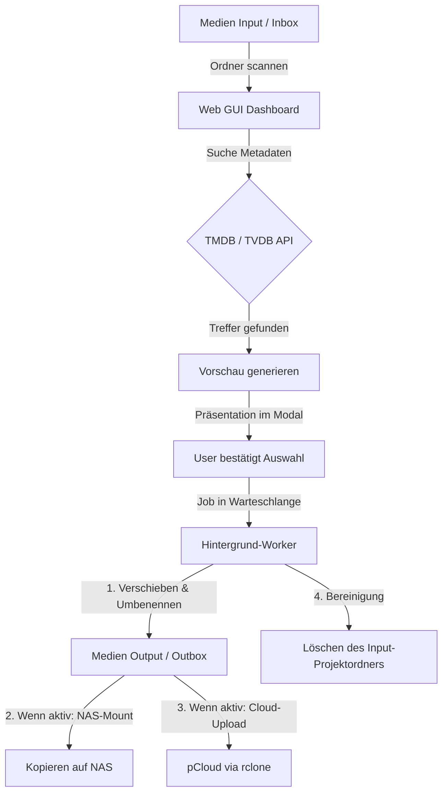

# Medienwerkzeug 🎬🎥

**Medienwerkzeug** ist eine intuitive Web-basierte Steuerungszentrale zur Verwaltung, Benennung, Strukturierung und Synchronisation von Filmen, TV-Serien, Doku-Serien, Einzel-Dokus und YouTube-Videos. Das Tool automatisiert den gesamten Prozess vom Import bis zur Archivierung auf dem NAS und in der Cloud.

---

## Inhaltsverzeichnis

- [Systemanforderungen](#%EF%B8%8F-systemanforderungen)
- [Hauptfunktionen](#-hauptfunktionen)
- [Projektstruktur](#-projektstruktur)
- [Entwickler-Wiki](#-entwickler-wiki)
- [System- & Datenfluss](#-system---datenfluss)
- [Setup & Installation](#%EF%B8%8F-setup--installation)
- [Starten der Anwendung](#-starten-der-anwendung)
  - [Variante A: macOS App](#variante-a-macos-app-empfohlen-für-desktop)
  - [Variante B: Kommandozeile](#variante-b-kommandozeile)
  - [Variante C: Docker (NAS / Server)](#variante-c-docker-empfohlen-für-nas--server)
- [Sicherheit & Zugriffskontrolle](#-sicherheit--zugriffskontrolle)
- [Best Practices](#-best-practices-serien-universen--sendeplätze-zb-arte-entdeckung-der-welt)
- [Unit-Tests ausführen](#-unit-tests-ausführen)

---


## ⚙️ Systemanforderungen
Das Medienwerkzeug ist für performante, fehlerresiliente Arbeitsabläufe optimiert.

* **Betriebssystem:** macOS (nativ optimiert für lokale Pfade und Papierkorb-Integration), auch lauffähig auf Linux/Windows mit angepassten Pfaden.
* **Prozessor (CPU):** Multicore empfohlen (für asynchrone Health-Scans und rclone-Uploads).
* **Arbeitsspeicher (RAM):** Mindestens 2 GB RAM (für Caching der Verzeichnisbäume beim Health-Scan mit +10.000 Dateien).
* **NAS & Storage:** SMB/NFS Freigaben müssen im OS erreichbar sein.
* **Abhängigkeiten:** `rclone` für pCloud-Sync, `ffmpeg`/`ffprobe` für intelligente Videokonvertierung (optional).

## 🚀 Hauptfunktionen
1. **Automatischer Metadaten-Abgleich:** Vollautomatische, fuzzy-gewichtete Suche auf TMDB und TVDB für Serien, Einzelepisoden, Filme und Dokumentationen mit intelligenter Namensbereinigung.
2. **Klares Vorschau-System:** Detaillierte Vorschau aller geplanten Umbenennungen, Zielpfade (NAS & pCloud getrennt) sowie Junk-Dateien vor der Ausführung.
3. **Einhaltung strenger Zielstrukturen:**
   * **Filme & Einzel-Dokus:** `[Kategorie-Unterpfad]/[Filmname (Jahr)]/` mit synchronisierten Covern (`poster.jpg` etc.).
   * **Serien & Doku-Serien:** `[Kategorie-Unterpfad]/[Serienname]/Staffel X/[Episode].mkv` sowie `tvshow.nfo` und Artworks.
4. **Zwei-Kanal-Synchronisation (Entkoppelt):**
   * **Lokale Outbox:** Verarbeitete Projekte landen strukturiert in `Medien Output`.
   * **NAS:** Robustes Übertragen durch lokale Container-Volumes (Docker) oder automatisches SMB-Mounten (macOS Desktop).
   * **pCloud:** Paralleler, performanter Upload via `rclone` (mit Echtzeit-Fortschritt).
5. **Integriertes Einstellungs-Dashboard (⚙️):** Bequeme Verwaltung von globalen Pfaden, flexiblen Importquellen (z.B. StreamFab, JDownloader) und dynamischen Sync-Kategorien über die Weboberfläche.
6. **Warteschlange & Persistenz:** Thread-sicheres Queue-System mit Speicherung des aktuellen Zustands. Abgebrochene Jobs können nach Server-Neustarts per Knopfdruck fortgesetzt werden.
7. **Multi-Staffel-Verarbeitung:** Unterstützung für die gleichzeitige Zuordnung und Einsortierung von Episoden über mehrere Staffeln hinweg.
8. **Native macOS Papierkorb-Integration:** Gelöschte Projektordner und Junk-Dateien werden sicher in den macOS-Papierkorb verschoben statt unwiderruflich gelöscht zu werden.
9. **Wartungs-Werkzeug (Medienpfade bereinigen):** Komfortabler Scan und Bereinigung von Müll- und Junkdateien in den Arbeitsordnern mit automatischer Entfernung leerer Unterordner.
10. **YouTube-Download:** Download einzelner Videos oder Playlists über `yt-dlp` mit Fortschrittsanzeige und automatischer Metadaten-Zuordnung.
11. **Ordner-Zugriff & Autostart (📂):** Direktes Öffnen der Medienordner über native macOS Finder-Buttons (nur Desktop-Modus) oder eine sichere, integrierte Web-Ordneransicht (Docker-Modus).
12. **Doubletten-Erkennung:** Automatischer Scan des NAS-Zielverzeichnisses nach bereits existierenden Episoden (Muster `SxxExx`) inklusive Anzeige von Auflösung und Dateigröße (via `ffprobe`) vor dem Starten.
13. **Visualisierte Fortschritts-Pipeline:** Vierstufige Fortschrittsanzeige in Echtzeit (`[Metadaten] ➔ [Konvertierung] ➔ [NAS-Kopieren] ➔ [pCloud-Sync]`) mit Statussymbolen und Prozentsätzen pro Job.
14. **Multi-Kanal-Benachrichtigungen:** Statusbenachrichtigungen über macOS (AppleScript), Telegram (Bot-API) und WhatsApp (CallMeBot) bei Abschluss von Jobs ab einer konfigurierbaren GB-Größenschwelle.
15. **Witz des Tages (Flachwitze):** Glassmorphe Modal-Einblendung beim App-Start und Jobabschluss (synchronisiert sich asynchron mit GitHub und bietet lokales Offline-Fallback).
16. **YouTube-Abo-Überwachung:** Dashboard zur automatischen stündlichen Hintergrundprüfung von YouTube-Kanälen/Playlists mit Suchfiltern, Zielkategorie-Zuweisung und automatisiertem Download.
17. **Premium-Design & Themes:** Umschaltbare Design-Themes (🌌 Deep Space, 🏔️ Nordic Slate, 🍂 Amber Warmth, 🍎 Apple Silver) mit butterweichen View-Transitions, 3D-Card-Parallax (Neigungs-Effekt) und mausfolgenden Lichtkegel-Glows.
18. **YouTube-Videomerge & Kanallogos:** Automatischer Abruf von Kanal-Profilbildern, zeitstempelbasierte Filterung (`last_checked_timestamp`) und Ausschluss-Keywords. Mehrteilige Videos können über den FFmpeg-`concat`-Demuxer verlustfrei zusammengefügt werden.
19. **Interaktiver Dubletten-Vergleicher (Upgrade-Löser):** Deep-Compare von Video-Auflösung, Bitrate, Codec und Größe bei bereits auf dem NAS vorhandenen Dateien inklusive direkter "Upgrade"-Aktion.
20. **Visuelles Statistik-Dashboard (📊):** Speicherplatzersparnis-Metriken, circular SVG-NAS-Speicherbelegungsdiagramm und ein interaktives, rein in SVG & CSS animiertes Balkendiagramm zur Visualisierung der Speicherersparnis der letzten 15 Konvertierungen.
21. **Media Health Dashboard (🔍):** Vollständiger Bibliotheks-Hintergrund-Scan über alle konfigurierten NAS-Kategorien hinweg zur Erkennung von fehlenden NFOs, fehlendem Artwork, Episodenlücken, Codec-Inkonsistenzen (ffprobe-Stichprobe), leeren Ordnern, verdächtig kleinen Videodateien, doppelt verschachtelten Filmordnern, kryptischen 8.3-Kurznamen, fehlendem Jahr im Ordnernamen, fehlender oder ungültiger FSK-Altersfreigabe und Ordner-/Dateiname-Mismatches. Quick-Fix-Buttons ermöglichen das direkte Auflösen von Verschachtelungen, Umbenennen (Ordner an Datei angleichen, Datei an Ordner angleichen oder freien Namen wählen) sowie das Setzen von FSK-Werten direkt in der NFO-Datei.
22. **NAS-weite Duplikat-Erkennung (🗑️):** Hintergrund-Erkennung und Gruppierung doppelter Serien-Episoden auf dem gesamten NAS mit smarter Bewertung (HEVC > Auflösung > Dateigröße) zur Bestimmung der optimal zu behaltenden Version und Berechnung des rückgewinnbaren Speicherplatzes inklusive sicherem Löschdialog.

---

## 📁 Projektstruktur

```
Medienwerkzeug/
├── Medienwerkzeug.app/       # Nativer macOS AppleScript-Wrapper zum Starten per Doppelklick
├── .env.example              # API-Keys Vorlage
├── .env                      # API-Keys (TMDB, TVDB, gitignored)
├── data/                     # Zentraler lokaler Datenordner (Einstellungen, Jobs, Caches, gitignored)
│   ├── settings.json         # Konfigurationsdatei der Pfade, Quellen und Kategorien
│   └── jobs_state.json       # Persistierter Status der Hintergrund-Jobs
├── logs/                     # Lokales Logverzeichnis (gitignored)
├── gui/                      # Schreibgeschützter Quellcode-Ordner
│   ├── main.py               # Einstiegspunkt & Flask-Server-Start
│   ├── server.py             # Test-Kompatibilitäts-Fassade (für alte Unittests)
│   ├── api/                  # Flask-Blueprints nach Domänen aufgeteilt
│   ├── core/                 # Backend-Logik (helpers, media, transfers, utils, notifications, health, duplicates)
│   ├── workers/              # Asynchrone Hintergrund-Worker (processor, youtube_worker)
│   ├── resources/            # Statische Release-Assets
│   │   └── jokes.json        # Witz des Tages (statische Vorlage)
│   └── static/               # Frontend-Ressourcen (HTML, CSS, JS, keine Stray-Skripte)
│       ├── index.html        # Modernes Master-Detail Dashboard
│       ├── style.css         # Modernes Styling (Dark Mode, responsive Layout)
│       └── app.js            # Frontend-Logik (API-Calls, UI-Status, Modals)
├── tests/                    # Unit- & Integrationstests (test_utils.py, test_dependencies.py)
├── docs/wiki/                # Entwicklerorientierte Architektur- und Ablaufdokumentation
├── README.md                 # Diese Übersicht
├── API.md                    # Dokumentation der REST-Endpunkte
└── REVIEW.md                 # Entwickler- & KI-Review-Richtlinien
```

---

## 🧭 Entwickler-Wiki

Für einen technischen Einstieg in Architektur, Verarbeitung, API, NAS-Werkzeuge
und Speicherziele siehe das [Entwickler-Wiki](docs/wiki/index.md).

---

## 🔄 System- & Datenfluss

Das folgende Diagramm zeigt den Lebenszyklus einer Mediendatei von der Inbox bis zum Zielort:



---

## 🛠️ Setup & Installation

### 1. Voraussetzungen
* **Python 3.9+** (Die erforderlichen Abhängigkeiten können über `pip install -r requirements.txt` installiert werden)
* **macOS** (für NAS SMB-Mounting und AppleScript-Wrapper)
* **yt-dlp** (muss im PATH erreichbar sein für YouTube-Downloads)
* **rclone** (für den pCloud-Upload über ein eingerichtetes Remote namens `pcloud:`)

### 2. Konfiguration
API-Keys können direkt in der Web-GUI unter **Einstellungen** (Metadaten API-Keys) eingetragen werden. Die Werte werden in der UI maskiert angezeigt (z. B. `****abcd`), um sie vor unbefugtem Auslesen zu schützen.

Alternativ kann manuell eine `.env` Datei im Projekt-Root (oder gem. `MW_ENV_FILE`) angelegt werden:
```env
TMDB_API_KEY=dein_tmdb_api_key
TVDB_API_KEY=dein_tvdb_api_key
```

Pfade und Synchronisationseinstellungen werden in `data/settings.json` verwaltet (oder direkt über die GUI-Einstellungen angepasst):
* **inbox_dir:** Pfad zum Ordner `Medien Input`.
* **outbox_dir:** Pfad zum Ordner `Medien Output`.
* **nas_root:** Mount-Pfad des NAS (z. B. `/Volumes/Kino`).
* **import_sources:** Liste von Pfaden, aus denen fertige Medien automatisch gesammelt in die Inbox importiert werden (z. B. StreamFab, JDownloader).
* **storage_targets:** Dynamisch verwaltete Speicherziele für NAS und Cloud-Dienste.
* **sync_categories:** Zuordnungen von Metadaten-Kategorien zu Unterpfaden auf deinen Speicherzielen.

### 3. Speicherziele & rclone Setup

Unter dem Einstellungs-Tab **"Speicher & Sync"** kannst du beliebig viele Speicherziele konfigurieren (z. B. dein lokales NAS oder Cloud-Anbieter wie pCloud, Google Drive etc.).

#### Was bedeuten die Felder?
* **Lokal-Pfad (Wurzelverzeichnis):** Der Pfad auf deinem Mac, unter dem das Speicherziel erreichbar ist (z. B. `/Volumes/Kino` für dein NAS oder `/Users/alex/pCloud Drive` für pCloud). Das Tool kopiert bevorzugt mit `rsync` an diesen lokalen Mount-Pfad.
* **rclone Remote (Optional):** Der Name der Verbindung in deiner rclone-Konfiguration (z. B. `pcloud:`). Dies dient als **automatisches Fallback**: Ist der lokale Mountpfad offline (weil die Sync-App geschlossen ist), lädt das Backend die Dateien per rclone direkt in die Cloud hoch.
* **SMB Details (nur NAS):** Konfiguration der lokalen IP-Adresse, der Backup-/Tailscale-IP, des Finder-Servernamens und des SMB-Share-Namens. Schlägt das direkte Mounting fehl, öffnet das Tool automatisch den Finder-Fallback.

#### rclone konfigurieren (Kurzanleitung)
1. **Installation:** Falls nicht installiert, installiere rclone über Homebrew im macOS Terminal:
   ```bash
   brew install rclone
   ```
2. **Einrichten eines neuen Remotes:**
   Führe im Terminal folgenden Befehl aus und folge dem interaktiven Assistenten:
   ```bash
   rclone config
   ```
   * Drücke `n` für "New remote".
   * Wähle einen Wunschnamen (z. B. `pcloud`). **Diesen Namen trägst du später in das Feld `rclone Remote` ein** (als `pcloud:`).
   * Wähle die Nummer für deinen Cloud-Speicher (z. B. `pcloud` oder `google drive`).
   * Folge den Anweisungen zur Browser-Authentifizierung.
3. **Verbindung prüfen:**
   Liste deine konfigurierten Remotes im Terminal auf:
   ```bash
   rclone listremotes
   ```
   Trage den ausgegebenen Namen (z. B. `pcloud:`) in das Einstellungs-Dashboard des Medienwerkzeugs ein.
4. **Verbindung testen (optional):**
   ```bash
   rclone about pcloud:
   ```
   Gibt das Speicher-Kontingent (gesamt/belegt/frei) zurück. Genau diese Abfrage nutzt
   auch das Dashboard, um die Speicherbelegung eines Cloud-Ziels anzuzeigen.

> **Beliebiger Anbieter:** Es ist **kein** anbieterspezifischer Code nötig – der Cloud-Dienst
> wird allein durch das `rclone-Remote` bestimmt. Für Google Drive trägst du z. B. `gdrive:`
> ein, für OneDrive `onedrive:` usw. Anzeige und Verarbeitungs-Schalter übernehmen automatisch
> den Namen des Speicherziels (z. B. „Auch in Google Drive sichern").
>
> **Mehrere Clouds gleichzeitig** (unabhängig schaltbar) sind noch nicht umgesetzt – siehe
> [`ROAD_TO_GLORY.md`](ROAD_TO_GLORY.md) (Abschnitt 1).
>
> 💡 In den Einstellungen unter **„Speicher & Sync"** gibt es neben der Erklärung ein
> **❓-Symbol**, das beim Drüberfahren eine rclone-Kurzanleitung einblendet.

---

## 💻 Starten der Anwendung

### Variante A: macOS App (Empfohlen für Desktop)
Doppelklicke auf `Medienwerkzeug.app` im Hauptverzeichnis. Das startet den Server im Hintergrund und öffnet die GUI automatisch im Webbrowser.

### Variante B: Kommandozeile
Öffne das Terminal und starte den Server manuell:
```bash
python3 gui/main.py
```
Die Anwendung ist danach unter [http://127.0.0.1:5001](http://127.0.0.1:5001) erreichbar.

### Variante C: Docker (Empfohlen für NAS / Server)

Das Medienwerkzeug kann als Docker-Container auf einem NAS oder Server betrieben werden. Das Image enthält alle Abhängigkeiten (`ffmpeg`, `yt-dlp`, `rclone`) — auf dem NAS muss nichts installiert werden.

#### 1. Voraussetzungen

- Docker auf dem NAS installiert (Synology: Paketcenter → Docker)
- SSH-Zugang zum NAS

> ⚠️ **Performance-Hinweis:** Videokonvertierungen (z. B. HEVC Umwandlung per FFmpeg) direkt auf dem NAS können durch schwächere NAS-CPUs deutlich langsamer sein als auf einem dedizierten Mac/PC. Nutze für große Video-Umwandlungen ggf. bevorzugt die macOS-Desktop-App.

#### 2. Ordner anlegen

Lege den Konfigurationsordner auf dem NAS an und setze die Besitzerrechte auf deinen NAS-Benutzer, damit die App darin schreiben darf:

```bash
mkdir -p /pfad/zu/medienwerkzeug/config
chown PUID:PGID /pfad/zu/medienwerkzeug/config
```

> **Deine PUID und PGID findest du mit:**
> ```bash
> id dein-nas-benutzername
> # Beispielausgabe: uid=1000(alex) gid=10(admin)
> # → PUID=1000, PGID=10
> ```

#### 3. docker-compose.yml anlegen

Erstelle eine `docker-compose.yml` auf dem NAS (z. B. unter `/pfad/zu/medienwerkzeug/docker-compose.yml`):

```yaml
services:
  medienwerkzeug:
    image: ghcr.io/dein-github-username/medienwerkzeug:latest
    container_name: medienwerkzeug
    user: "PUID:PGID"          # Ersetze mit deinen Werten, z. B. "1000:10"
    ports:
      - "5811:5001"
    environment:
      - TZ=Europe/Berlin
      - PUID=1000               # Deine UID
      - PGID=10                 # Deine GID
    volumes:
      - /pfad/zu/medienwerkzeug/config:/config
      - /pfad/zu/deinen/medien:/media   # Übergeordneter Ordner deiner Mediathek
    restart: unless-stopped
```

> **Zum Volume `/media`:** Trage den übergeordneten Ordner deiner Mediathek ein. Liegen deine Medien z. B. unter `/volume1/Kino` mit Unterordnern `Filme`, `Serien`, `Doku` usw., reicht ein einziger Eintrag:
> ```yaml
> - /volume1/Kino:/media
> ```
> Die App sieht dann intern `/media/Filme`, `/media/Serien` usw. — alle Unterordner automatisch.

#### 4. Container starten

```bash
docker compose up -d
```

Die Anwendung ist danach unter `http://deine-nas-ip:5811` erreichbar.

Beim ersten Start öffnet sich der Einrichtungsassistent, der dich durch API-Keys, Pfade und Sicherheitseinstellungen führt.

#### 5. Updates einspielen

Wenn eine neue Version verfügbar ist, reichen zwei Befehle auf dem NAS:

```bash
docker compose pull     # Neues Image holen
docker compose up -d    # Container mit neuem Image neu starten
```

Deine Konfiguration in `/config` bleibt dabei vollständig erhalten.

#### 6. Fehlerdiagnose

```bash
docker logs medienwerkzeug        # Letzter Output
docker logs -f medienwerkzeug     # Live mitlesen
docker ps                         # Prüfen ob Container läuft
```

#### 7. Daten & Profile (Data Profiles)

Das Medienwerkzeug speichert Zustandsdaten, Konvertierungshistorien und spezifische Metadaten (wie YouTube-Kanal-Logos und Abo-Informationen) im Ordner `/config/data/profiles`. Diese Profile ermöglichen eine schnelle Erkennung bei wiederkehrenden Downloads und sorgen dafür, dass z.B. bei YouTube-Abonnements nur neue Videos geladen werden. Durch das `/config` Volume bleiben diese Daten auch bei Container-Updates sicher erhalten.

---

## 🔒 Sicherheit & Zugriffskontrolle

Da das Medienwerkzeug als Flask-Server im lokalen Netzwerk (LAN) erreichbar ist, verfügt es über einen optionalen Zugriffsschutz:

* **Passwortschutz:** In den Einstellungen unter **„Sicherheit“** kann ein Passwort oder eine PIN festgelegt werden. Ist ein Passwort aktiv, sperrt die App den Zugriff für alle nicht-authentifizierten Clients im LAN. Ohne Passwort bleibt das Tool frei zugänglich.
* **CSRF-Schutz:** Alle zustandsändernden Endpunkte (POST, PUT, DELETE) sind über ein Double-Submit-Cookie-Verfahren (Custom Header `X-CSRF-Token` abgeglichen mit einem session-gebundenen Cookie-Hash) gegen Cross-Site Request Forgery geschützt.
* **Brute-Force-Schutz:** Der Login-Endpunkt blockiert Angreifer nach 5 Fehlversuchen automatisch für eine Minute (IP-basiert) und wendet ein progressives Anmelde-Verzögerungsverhalten an.
* **Passwort-Reset (Notfall-Reset):** Solltest du dein Passwort vergessen haben, kannst du den Zugriffsschutz manuell zurücksetzen. Lösche dazu einfach den Wert von `"password_hash"` in deiner `data/settings.json`-Datei:
  ```json
  "password_hash": ""
  ```
  Nach dem Neuladen der App ist der Zugriffsschutz sofort wieder deaktiviert.

---

## 📖 Best Practices: Serien-Universen & Sendeplätze (z.B. ARTE "Entdeckung der Welt")

Bei Sendungen, die unter einem gemeinsamen Dach-Sendeplatz laufen (wie *Entdeckung der Welt*, *Arte Thema*, *ZDF-Reportage*), aber inhaltlich eigenständige Unterserien mit eigener Metadaten-Struktur sind (z. B. *Nationalparks China*, *Wunder der Tiefsee*), empfiehlt sich folgender Workflow für Emby/Plex:

1. **Unterserie als eigenständige Serie erfassen:**
   * Anstatt den übergeordneten Sendeplatz als Seriennamen zu nutzen, wird die jeweilige Unterserie (z. B. *Nationalparks China*) als eigenständige Serie angelegt.
   * **Vorteil:** Saubere Metadaten-Erkennung, korrekte Poster, Episodenguides und Beschreibungen aus den Datenbanken (TMDB/TVDB).
2. **Händische Namensanpassung in der GUI:**
   * Nutze das Feld **„Serienname / Ordnername auf NAS (anpassbar)“**, um den Namen der Unterserie sauber einzutragen (z. B. *Nationalparks China* statt des langen, vom Scraper generierten Titels).
3. **Zusammenführung im Mediencenter via Kollektion:**
   * Lege in Plex oder Emby manuell eine Kollektion an (z. B. „Entdeckung der Welt“), um die eigenständigen Unterserien visuell miteinander zu gruppieren.

---

## 🧪 Unit-Tests ausführen

Um die Testsuite für Hilfsfunktionen, Pfadbereinigungen und Job-Serialisierung auszuführen, führe folgenden Befehl im Hauptverzeichnis aus:
```bash
python3 -m unittest discover -s tests -b
```

Der Schalter `-b` puffert die ausführlichen Logs erfolgreicher Tests. Wenn ein
Test fehlschlägt, zeigt `unittest` die relevanten Ausgaben weiterhin an.
