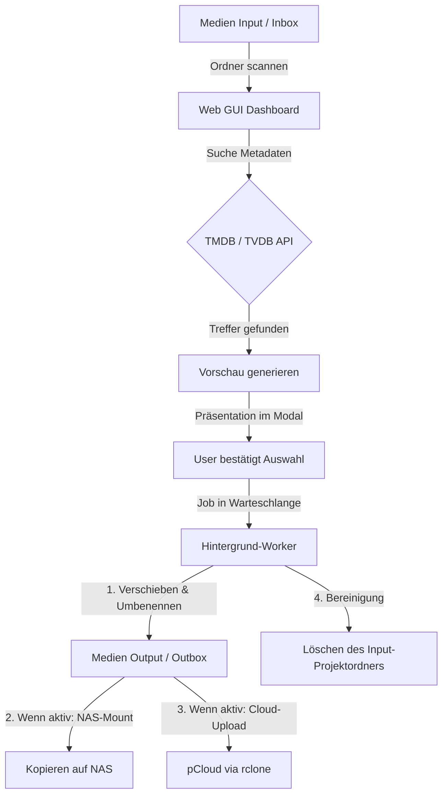

# Medienwerkzeug 🎬🎥

**Medienwerkzeug** ist eine intuitive Web-basierte Steuerungszentrale zur Verwaltung, Benennung, Strukturierung und Synchronisation von Filmen, TV-Serien, Doku-Serien, Einzel-Dokus und YouTube-Videos. Das Tool automatisiert den gesamten Prozess vom Import bis zur Archivierung auf dem NAS und in der Cloud.

---

## 🚀 Hauptfunktionen
1. **Automatischer Metadaten-Abgleich:** Vollautomatische, fuzzy-gewichtete Suche auf TMDB und TVDB für Serien, Einzelepisoden, Filme und Dokumentationen mit intelligenter Namensbereinigung.
2. **Klares Vorschau-System:** Detaillierte Vorschau aller geplanten Umbenennungen, Zielpfade (NAS & pCloud getrennt) sowie Junk-Dateien vor der Ausführung.
3. **Einhaltung strenger Zielstrukturen:**
   * **Filme & Einzel-Dokus:** `[Kategorie-Unterpfad]/[Filmname (Jahr)]/` mit synchronisierten Covern (`poster.jpg` etc.).
   * **Serien & Doku-Serien:** `[Kategorie-Unterpfad]/[Serienname]/Staffel X/[Episode].mkv` sowie `tvshow.nfo` und Artworks.
4. **Zwei-Kanal-Synchronisation (Entkoppelt):**
   * **Lokale Outbox:** Verarbeitete Projekte landen strukturiert in `Medien Output`.
   * **NAS (SMB):** Robustes Mounten und progressives Kopieren via `rsync` (mit macOS-Fallbacks und `--inplace`-Kompatibilität für Mounts).
   * **pCloud:** Paralleler, performanter Upload via `rclone` (mit Echtzeit-Fortschritt).
5. **Integriertes Einstellungs-Dashboard (⚙️):** Bequeme Verwaltung von globalen Pfaden, flexiblen Importquellen (z.B. StreamFab, JDownloader) und dynamischen Sync-Kategorien über die Weboberfläche.
6. **Warteschlange & Persistenz:** Thread-sicheres Queue-System mit Speicherung des aktuellen Zustands. Abgebrochene Jobs können nach Server-Neustarts per Knopfdruck fortgesetzt werden.
7. **Multi-Staffel-Verarbeitung:** Unterstützung für die gleichzeitige Zuordnung und Einsortierung von Episoden über mehrere Staffeln hinweg.
8. **Native macOS Papierkorb-Integration:** Gelöschte Projektordner und Junk-Dateien werden sicher in den macOS-Papierkorb verschoben statt unwiderruflich gelöscht zu werden.
9. **Wartungs-Werkzeug (Medienpfade bereinigen):** Komfortabler Scan und Bereinigung von Müll- und Junkdateien in den Arbeitsordnern mit automatischer Entfernung leerer Unterordner.
10. **YouTube-Download:** Download einzelner Videos oder Playlists über `yt-dlp` mit Fortschrittsanzeige und automatischer Metadaten-Zuordnung.
11. **Finder-Integration & Autostart (📂):** Direktes Öffnen der Medienordner über Finder-Buttons im UI sowie optionales automatisches Öffnen von Outbox, NAS und pCloud im Finder nach erfolgreicher Verarbeitung.
12. **Doubletten-Erkennung:** Automatischer Scan des NAS-Zielverzeichnisses nach bereits existierenden Episoden (Muster `SxxExx`) inklusive Anzeige von Auflösung und Dateigröße (via `ffprobe`) vor dem Starten.
13. **Visualisierte Fortschritts-Pipeline:** Vierstufige Fortschrittsanzeige in Echtzeit (`[Metadaten] ➔ [Konvertierung] ➔ [NAS-Kopieren] ➔ [pCloud-Sync]`) mit Statussymbolen und Prozentsätzen pro Job.
14. **Multi-Kanal-Benachrichtigungen:** Statusbenachrichtigungen über macOS (AppleScript), Telegram (Bot-API) und WhatsApp (CallMeBot) bei Abschluss von Jobs ab einer konfigurierbaren GB-Größenschwelle.
15. **Witz des Tages (Flachwitze):** Glassmorphe Modal-Einblendung beim App-Start und Jobabschluss (synchronisiert sich asynchron mit GitHub und bietet lokales Offline-Fallback).
16. **YouTube-Abo-Überwachung:** Dashboard zur automatischen stündlichen Hintergrundprüfung von YouTube-Kanälen/Playlists mit Suchfiltern, Zielkategorie-Zuweisung und automatisiertem Download.
17. **Premium-Design & Themes:** Umschaltbare Design-Themes (🌌 Deep Space, 🏔️ Nordic Slate, 🍂 Amber Warmth, 🍎 Apple Silver) mit butterweichen View-Transitions, 3D-Card-Parallax (Neigungs-Effekt) und mausfolgenden Lichtkegel-Glows.
18. **YouTube-Videomerge & Kanallogos:** Automatischer Abruf von Kanal-Profilbildern, zeitstempelbasierte Filterung (`last_checked_timestamp`) und Ausschluss-Keywords. Mehrteilige Videos können über den FFmpeg-`concat`-Demuxer verlustfrei zusammengefügt werden.
19. **Interaktiver Dubletten-Vergleicher (Upgrade-Löser):** Deep-Compare von Video-Auflösung, Bitrate, Codec und Größe bei bereits auf dem NAS vorhandenen Dateien inklusive direkter "Upgrade"-Aktion.
20. **Visuelles Statistik-Dashboard (📊):** Speicherplatzersparnis-Metriken, circular SVG-NAS-Speicherbelegungsdiagramm und ein interaktives, rein in SVG & CSS animiertes Balkendiagramm zur Visualisierung der Speicherersparnis der letzten 15 Konvertierungen.

---

## 📁 Projektstruktur

```
Medienwerkzeug/
├── Medienwerkzeug.app/       # Nativer macOS AppleScript-Wrapper zum Starten per Doppelklick
├── gui/
│   ├── server.py             # Python-HTTP-Server (Handling der API-Routen)
│   ├── settings.json         # Konfigurationsdatei der Pfade, Quellen und Kategorien
│   ├── jobs_state.json       # Persistierter Status der Hintergrund-Jobs
│   ├── .env                  # API-Keys (TMDB, TVDB)
│   ├── core/                 # Modularisierte Backend-Logik (utils.py, sync.py, jobs.py, media.py)
│   ├── data/                 # Lokaler Datenordner (Profiles und Konvertierungshistorie)
│   └── static/               # Frontend-Ressourcen (HTML, CSS, JS)
│       ├── index.html        # Modernes Master-Detail Dashboard
│       ├── style.css         # Modernes Styling (Dark Mode, responsive Layout)
│       └── app.js            # Frontend-Logik (API-Calls, UI-Status, Modals)
├── tests/                    # Unit- & Integrationstests (test_utils.py, test_jobs.py)
├── README.md                 # Diese Übersicht
├── API.md                    # Dokumentation der REST-Endpunkte
└── REVIEW.md                 # Entwickler- & KI-Review-Richtlinien
```

---

## 🔄 System- & Datenfluss

Das folgende Diagramm zeigt den Lebenszyklus einer Mediendatei von der Inbox bis zum Zielort:



---

## 🛠️ Setup & Installation

### 1. Voraussetzungen
* **Python 3.9+** (Verwendet ausschließlich standardmäßige Bibliotheken, keine externen `pip`-Pakete benötigt!)
* **macOS** (für NAS SMB-Mounting und AppleScript-Wrapper)
* **yt-dlp** (muss im PATH erreichbar sein für YouTube-Downloads)
* **rclone** (für den pCloud-Upload über ein eingerichtetes Remote namens `pcloud:`)

### 2. Konfiguration
Erstelle eine `.env` Datei im Ordner `gui/`:
```env
TMDB_API_KEY=dein_tmdb_api_key
TVDB_API_KEY=dein_tvdb_api_key
```

Pfade und Synchronisationseinstellungen werden in `gui/settings.json` verwaltet (oder direkt über die GUI-Einstellungen angepasst):
* **inbox_dir:** Pfad zum Ordner `Medien Input`.
* **outbox_dir:** Pfad zum Ordner `Medien Output`.
* **nas_root:** Mount-Pfad des NAS (z. B. `/Volumes/Kino`).
* **import_sources:** Liste von Pfaden, aus denen fertige Medien automatisch gesammelt in die Inbox importiert werden (z. B. StreamFab, JDownloader).
* **sync_categories:** Zuordnungen von Metadaten-Kategorien zu Unterpfaden auf dem NAS und pCloud-Ordnern.

---

## 💻 Starten der Anwendung

### Variante A: macOS App (Empfohlen)
Doppelklicke auf `Medienwerkzeug.app` im Hauptverzeichnis. Das startet den Server im Hintergrund und öffnet die GUI automatisch im Webbrowser.

### Variante B: Kommandozeile
Öffne das Terminal und starte den Server manuell:
```bash
python3 gui/server.py
```
Die Anwendung ist danach unter [http://127.0.0.1:8000](http://127.0.0.1:8000) erreichbar.

---

## 📖 Best Practices: Serien-Universen & Sendeplätze (z.B. ARTE "Entdeckung der Welt")

Bei Sendungen, die unter einem gemeinsamen Dach-Sendeplatz laufen (wie *Entdeckung der Welt*, *Arte Thema*, *ZDF-Reportage*), aber inhaltlich eigenständige Unterserien mit eigener Metadaten-Struktur sind (z. B. *Nationalparks China*, *Wunder der Tiefsee*), empfiehlt sich folgender Workflow für Emby/Plex:

1. **Unterserie als eigenständige Serie erfassen:**
   * Anstatt den übergeordneten Sendeplatz als Seriennamen zu nutzen, wird die jeweilige Unterserie (z. B. *Nationalparks China*) als eigenständige Serie angelegt.
   * **Vorteil:** Saubere Metadaten-Erkennung, korrekte Poster, Episodenguides und Beschreibungen aus den Datenbanken (TMDB/TVDB).
2. **Händische Namensanpassung in der GUI:**
   * Nutze das Feld **„Serienname / Ordnername auf NAS (anpassbar)“**, um den Namen der Unterserie sauber einzutragen (z. B. *Nationalparks China* statt des langen, vom Scraper generierten Titels).
3. **Zusammenführung im Mediencenter via Kollektion:**
   * Lege in Plex oder Emby manuell eine Kollektion an (z. B. „Entdeckung der Welt“), um die eigenständigen Unterserien visuell miteinander zu gruppieren.

---

## 🧪 Unit-Tests ausführen

Um die Testsuite für Hilfsfunktionen, Pfadbereinigungen und Job-Serialisierung auszuführen, führe folgenden Befehl im Hauptverzeichnis aus:
```bash
python3 -m unittest discover -s tests
```

