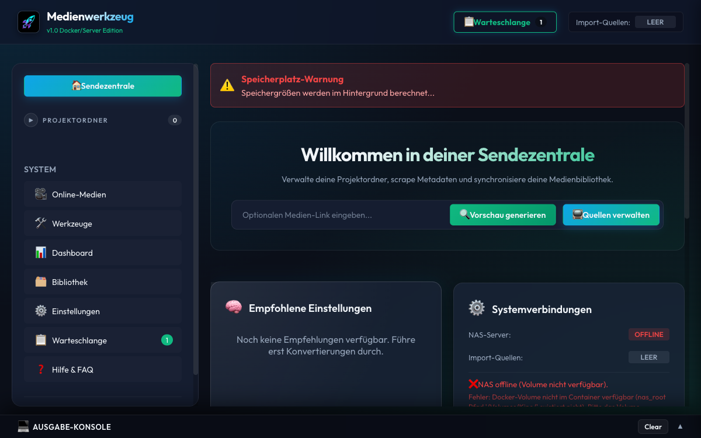
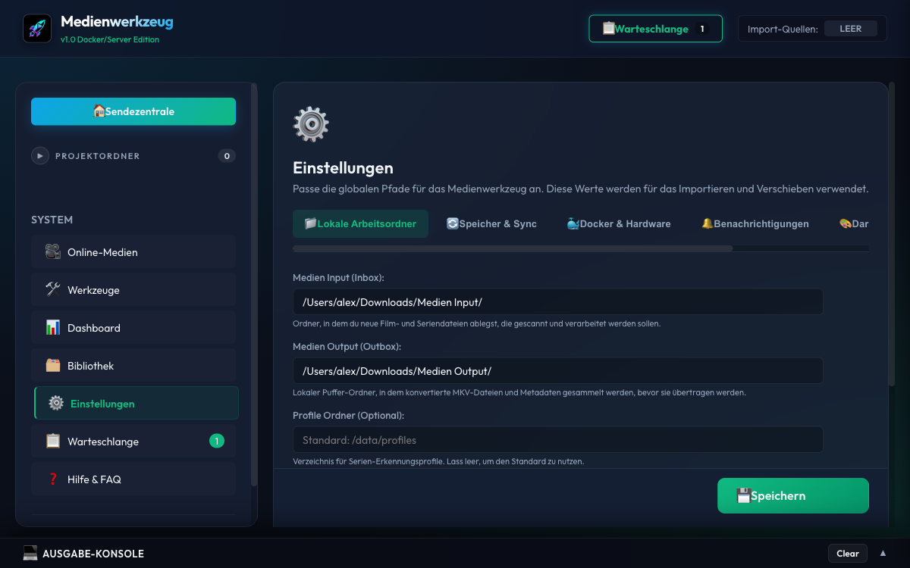
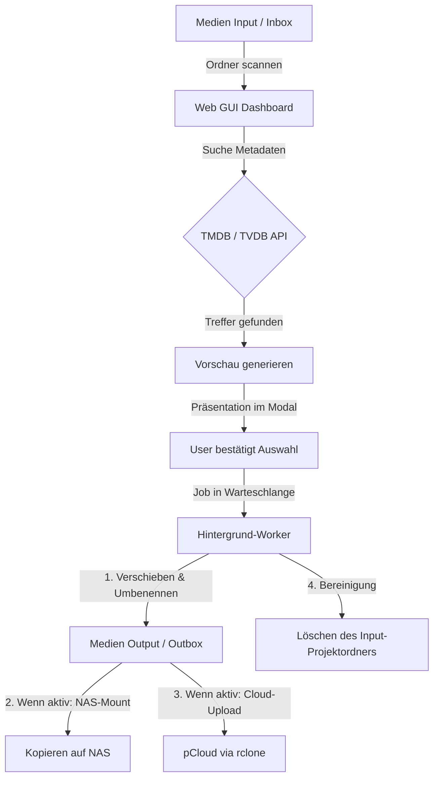

# Medienwerkzeug

**Medienwerkzeug** ist die Vorbereitungs- und Ordnungszentrale für deine private Medienbibliothek, bevor Plex, Jellyfin, Emby oder ähnliche Medienserver übernehmen. Das Tool sorgt dafür, dass Dateien, Ordner, Staffelstrukturen, Metadaten und Zielpfade auf der Platte sauber, einheitlich und serverfreundlich vorbereitet sind.

Statt selbst ein weiterer Mediaserver sein zu wollen, arbeitet Medienwerkzeug Hand in Hand mit deiner bestehenden Medienumgebung: Es nimmt rohe Importordner, chaotische Dateinamen und verteilte Quellen entgegen und formt daraus eine Bibliothek, die auf NAS, externen Laufwerken und Cloud-Zielen nachvollziehbar organisiert ist und von Plex, Jellyfin oder Emby deutlich besser erkannt wird.

**Kurz gesagt:** Medienwerkzeug ist der Schritt **vor** deinem Medienserver. Es hilft dir dabei, dass auf der Platte alles so aussieht, wie dein Medienserver es später haben möchte.

Für Menschen mit einer wachsenden Mediathek bedeutet das vor allem eins: weniger Dateichaos, weniger manuelle Nacharbeit und deutlich mehr Vertrauen darin, dass Ordner, Namen und Zielpfade am Ende wirklich zusammenpassen.



---

## Inhaltsverzeichnis

- [Warum Medienwerkzeug?](#-warum-medienwerkzeug)
- [Schnellstart](#-schnellstart)
- [Systemanforderungen](#%EF%B8%8F-systemanforderungen)
- [Setup & Installation](#%EF%B8%8F-setup--installation)
- [Starten der Anwendung](#-starten-der-anwendung)
  - [Variante A: Docker (Empfohlen, jetzt verfügbar)](#variante-a-docker-empfohlen-jetzt-verf%C3%BCgbar)
  - [Variante B: Desktop-App (Coming Soon)](#variante-b-desktop-app-coming-soon)
  - [Variante C: Kommandozeile (für Entwicklung)](#variante-c-kommandozeile-f%C3%BCr-entwicklung)
- [Hauptfunktionen](#-hauptfunktionen)
- [Projektstruktur](#-projektstruktur)
- [Entwickler-Wiki](#-entwickler-wiki)
- [System- & Datenfluss](#-system---datenfluss)
- [Sicherheit & Zugriffskontrolle](#-sicherheit--zugriffskontrolle)
- [Transparenz: Datenschutz & ausgehende Verbindungen](#-transparenz-datenschutz--ausgehende-verbindungen)
- [Best Practices](#-best-practices-serien-universen--sendeplätze-zb-arte-entdeckung-der-welt)
- [Unit-Tests ausführen](#-unit-tests-ausführen)

---

## Warum Medienwerkzeug?

Medienwerkzeug löst ein Problem, das Plex, Jellyfin oder Emby bewusst nicht lösen: den Weg **vor** der eigentlichen Bibliothek.

Wenn bereits vorhandene Mediendateien, Archivbestände oder lokale Importquellen in uneinheitlichen Ordnern landen, kümmert sich Medienwerkzeug um genau diesen unordentlichen Zwischenzustand:

* Es erkennt Inhalte, bereinigt Namen und bringt Serien, Filme und Dokus in eine konsistente Struktur.
* Es bereitet Ordner, Dateien, Artwork und Metadaten so auf, dass nachgelagerte Medienserver sauberer matchen.
* Es synchronisiert die fertigen Ergebnisse kontrolliert auf NAS- und Cloud-Ziele.
* Es hilft dir dabei, dass deine Mediathek auf der Platte langfristig ordentlich und wartbar bleibt, statt mit jeder Quelle chaotischer zu werden.

Damit ist Medienwerkzeug kein Ersatz für Plex, Jellyfin oder Emby, sondern deren vorgeschaltete Ordnungs- und Vorbereitungsinstanz.

Der Fokus liegt auf der Organisation, Benennung und Synchronisation eigener oder berechtigt genutzter Medienbestände, nicht auf dem Beschaffen von Inhalten.

## Schnellstart

**Heute verfügbar:** die Docker-Version für NAS und Server.

**In Vorbereitung:** eine bequemere Desktop-App für Endnutzer, die später ohne Docker auskommen soll.

Wenn du Medienwerkzeug direkt ausprobieren willst, kommst du heute am schnellsten über Docker ans Ziel:

1. Docker auf deinem NAS oder Server bereitstellen.
2. Die Compose-Vorlage aus dieser README übernehmen.
3. Container starten und den Einrichtungsassistenten im Browser öffnen.

Die Oberfläche ist dabei nicht nur funktional, sondern führt dich sichtbar durch die wichtigsten Arbeitsbereiche: Import, Vorschau, Einstellungen, Bibliothek und Warteschlange.

## Systemanforderungen
Das Medienwerkzeug ist für performante, fehlerresiliente Arbeitsabläufe optimiert.

* **Betriebssystem:** macOS (nativ optimiert für lokale Pfade und Papierkorb-Integration), auch lauffähig auf Linux/Windows mit angepassten Pfaden.
* **Prozessor (CPU):** Multicore empfohlen (für asynchrone Health-Scans und rclone-Uploads).
* **Arbeitsspeicher (RAM):** Mindestens 2 GB RAM (für Caching der Verzeichnisbäume beim Health-Scan mit +10.000 Dateien).
* **NAS & Storage:** SMB/NFS Freigaben müssen im OS erreichbar sein.
* **Abhängigkeiten:** `rclone` für Cloud-Sync, `ffmpeg`/`ffprobe` für intelligente Videokonvertierung (optional).

---

## Setup & Installation

### 1. Welcher Installationsweg ist aktuell gedacht?

Der aktuell vorgesehene und aktiv verteilte Installationsweg ist **Docker**.

* **Docker / NAS / Server:** der empfohlene Weg für die reale Nutzung heute.
* **Desktop-App:** ist geplant, aber noch nicht als reguläre Endnutzer-Version verfügbar.
* **Kommandozeile:** sinnvoll für Entwicklung, Tests oder manuelles lokales Starten.

### 2. Docker-Installation

### Variante A: Docker (Empfohlen, jetzt verfügbar)

Das Medienwerkzeug kann als Docker-Container auf einem NAS oder Server betrieben werden. Das Image enthält die benötigten Werkzeuge für die Kernfunktionen sowie optionale Zusatzpfade (`ffmpeg`, `rclone`, optional `yt-dlp`) - auf dem NAS muss nichts zusätzlich installiert werden.



#### Voraussetzungen

- Docker auf dem NAS installiert (Synology: Paketcenter -> Docker)
- SSH-Zugang zum NAS

> ⚠️ **Performance-Hinweis:** Videokonvertierungen (z. B. HEVC Umwandlung per FFmpeg) direkt auf dem NAS können durch schwächere NAS-CPUs deutlich langsamer sein als auf einem dedizierten Mac/PC. Nutze für große Video-Umwandlungen gegebenenfalls später bevorzugt die Desktop-Version.

#### Schritt 1: Ordner anlegen

Lege den Konfigurationsordner auf dem NAS an und setze die Besitzerrechte auf deinen NAS-Benutzer, damit die App darin schreiben darf:

```bash
mkdir -p /pfad/zu/medienwerkzeug/config
chown PUID:PGID /pfad/zu/medienwerkzeug/config
```

> **Deine PUID und PGID findest du mit:**
> ```bash
> id dein-nas-benutzername
> # Beispielausgabe: uid=1000(alex) gid=10(admin)
> # -> PUID=1000, PGID=10
> ```

#### Schritt 2: `docker-compose.yml` anlegen

Erstelle eine `docker-compose.yml` auf dem NAS (z. B. unter `/pfad/zu/medienwerkzeug/docker-compose.yml`):

```yaml
services:
  medienwerkzeug:
    image: ghcr.io/dein-github-username/medienwerkzeug:latest
    container_name: medienwerkzeug
    user: "PUID:PGID"          # Ersetze mit deinen Werten, z. B. "1000:10"
    ports:
      - "5811:5001"
    environment:
      - TZ=Europe/Berlin
      - PUID=1000               # Deine UID
      - PGID=10                 # Deine GID
    volumes:
      - /pfad/zu/medienwerkzeug/config:/config
      - /pfad/zu/deinen/medien:/media   # Übergeordneter Ordner deiner Mediathek
    restart: unless-stopped
```

> **Zum Volume `/media`:** Trage den übergeordneten Ordner deiner Mediathek ein. Liegen deine Medien z. B. unter `/volume1/Media` mit Unterordnern `Filme`, `Serien`, `Doku` usw., reicht ein einziger Eintrag:
> ```yaml
> - /volume1/Media:/media
> ```
> Die App sieht dann intern `/media/Filme`, `/media/Serien` usw. - alle Unterordner automatisch.

#### Schritt 3: Container starten

```bash
docker compose up -d
```

Die Anwendung ist danach unter `http://deine-nas-ip:5811` erreichbar.

Beim ersten Start öffnet sich der Einrichtungsassistent, der dich durch API-Keys, Pfade und Sicherheitseinstellungen führt.

#### Schritt 4: Updates einspielen

Wenn eine neue Version verfügbar ist, reichen zwei Befehle auf dem NAS:

```bash
docker compose pull     # Neues Image holen
docker compose up -d    # Container mit neuem Image neu starten
```

Deine Konfiguration in `/config` bleibt dabei vollständig erhalten.

#### Schritt 5: Fehlerdiagnose

```bash
docker logs medienwerkzeug        # Letzter Output
docker logs -f medienwerkzeug     # Live mitlesen
docker ps                         # Prüfen ob Container läuft
```

#### Schritt 6: Daten & Profile (Data Profiles)

Das Medienwerkzeug speichert Zustandsdaten, Konvertierungshistorien und spezifische Metadaten im Ordner `/config/data/profiles`. Diese Profile ermöglichen eine schnelle Wiedererkennung wiederkehrender Serien, Quellen und Verarbeitungsläufe. Durch das `/config` Volume bleiben diese Daten auch bei Container-Updates sicher erhalten.

### 3. Grundkonfiguration

API-Keys können direkt in der Web-GUI unter **Einstellungen** (Metadaten API-Keys) eingetragen werden. Die Werte werden in der UI maskiert angezeigt (z. B. `****abcd`), um sie vor unbefugtem Auslesen zu schützen.

Alternativ kann manuell eine `.env` Datei im Projekt-Root (oder gem. `MW_ENV_FILE`) angelegt werden:
```env
TMDB_API_KEY=dein_tmdb_api_key
TVDB_API_KEY=dein_tvdb_api_key
```

Pfade und Synchronisationseinstellungen werden in `data/settings.json` verwaltet (oder direkt über die GUI-Einstellungen angepasst):
* **inbox_dir:** Pfad zum Ordner `Medien Input`.
* **outbox_dir:** Pfad zum Ordner `Medien Output`.
* **nas_root:** Mount-Pfad des NAS (z. B. `/Volumes/Kino`).
* **import_sources:** Liste lokaler Pfade, aus denen bereits vorhandene, berechtigte Mediendateien gesammelt in die Inbox importiert werden.
* **storage_targets:** Dynamisch verwaltete Speicherziele für NAS und Cloud-Dienste.
* **sync_categories:** Zuordnungen von Metadaten-Kategorien zu Unterpfaden auf deinen Speicherzielen.

### 4. Speicherziele & `rclone` Setup

Unter dem Einstellungs-Tab **"Speicher & Sync"** kannst du beliebig viele Speicherziele konfigurieren (z. B. dein lokales NAS oder Cloud-Anbieter wie pCloud, Google Drive etc.).

#### Was bedeuten die Felder?
* **Lokal-Pfad (Wurzelverzeichnis):** Der Pfad auf deinem Mac, unter dem das Speicherziel erreichbar ist (z. B. `/Volumes/Kino` für dein NAS oder `/Users/benutzer/Cloud-Laufwerk` für den Cloud-Speicher). Das Tool kopiert bevorzugt mit `rsync` an diesen lokalen Mount-Pfad.
* **rclone Remote (Optional):** Der Name der Verbindung in deiner rclone-Konfiguration (z. B. `pcloud:`). Dies dient als **automatisches Fallback**: Ist der lokale Mountpfad offline (weil die Sync-App geschlossen ist), lädt das Backend die Dateien per `rclone` direkt in die Cloud hoch.
* **SMB Details (nur NAS):** Konfiguration der lokalen Serveradresse, der alternativen IP-Adresse (Tailscale/VPN) und des Freigabennamens. Der Finder-Fallback wird nur beim manuellen NAS-Verbinden geöffnet, nicht während automatischer Verarbeitungsläufe.

#### `rclone` konfigurieren (Kurzanleitung)
1. **Installation:** Falls nicht installiert, installiere `rclone` über Homebrew im macOS Terminal:
   ```bash
   brew install rclone
   ```
2. **Einrichten eines neuen Remotes:**
   Führe im Terminal folgenden Befehl aus und folge dem interaktiven Assistenten:
   ```bash
   rclone config
   ```
   * Drücke `n` für "New remote".
   * Wähle einen Wunschnamen (z. B. `pcloud`). **Diesen Namen trägst du später in das Feld `rclone Remote` ein** (als `pcloud:`).
   * Wähle die Nummer für deinen Cloud-Speicher (z. B. `pcloud` oder `google drive`).
   * Folge den Anweisungen zur Browser-Authentifizierung.
3. **Verbindung prüfen:**
   Liste deine konfigurierten Remotes im Terminal auf:
   ```bash
   rclone listremotes
   ```
   Trage den ausgegebenen Namen (z. B. `pcloud:`) in das Einstellungs-Dashboard des Medienwerkzeugs ein.
4. **Verbindung testen (optional):**
   ```bash
   rclone about pcloud:
   ```
   Gibt das Speicher-Kontingent (gesamt/belegt/frei) zurück. Genau diese Abfrage nutzt
   auch das Dashboard, um die Speicherbelegung eines Cloud-Ziels anzuzeigen.

> **Beliebiger Anbieter:** Es ist **kein** anbieterspezifischer Code nötig - der Cloud-Dienst
> wird allein durch das `rclone-Remote` bestimmt. Für Google Drive trägst du z. B. `gdrive:`
> ein, für OneDrive `onedrive:` usw. Anzeige und Verarbeitungs-Schalter übernehmen automatisch
> den Namen des Speicherziels (z. B. „Auch in Google Drive sichern").
>
> **Mehrere Clouds gleichzeitig** (unabhängig schaltbar) sind noch nicht umgesetzt - siehe
> [`AFTER_RELEASE_ROADMAP.md`](AFTER_RELEASE_ROADMAP.md) (Punkt 1).
>
> 💡 In den Einstellungen unter **„Speicher & Sync"** gibt es neben der Erklärung ein
> **❓-Symbol**, das beim Drüberfahren eine `rclone`-Kurzanleitung einblendet.

## Hauptfunktionen
1. **Automatischer Metadaten-Abgleich:** Vollautomatische, fuzzy-gewichtete Suche auf TMDB und TVDB für Serien, Einzelepisoden, Filme und Dokumentationen mit intelligenter Namensbereinigung. Für TV-Serien wird ein ID-basiertes Matching-Fallback (TMDB-/TVDB-IDs aus bestehenden `tvshow.nfo` auf dem NAS) genutzt, um Ordner-Splits und Fehlausrichtungen zu verhindern.
2. **Klares Vorschau-System:** Detaillierte Vorschau aller geplanten Umbenennungen, Zielpfade (NAS & pCloud getrennt) sowie Junk-Dateien vor der Ausführung.
3. **Einhaltung strenger Zielstrukturen:**
   * **Filme & Einzel-Dokus:** `[Kategorie-Unterpfad]/[Filmname (Jahr)]/` mit synchronisierten Covern (`poster.jpg` etc.).
   * **Serien & Doku-Serien:** `[Kategorie-Unterpfad]/[Serienname]/Staffel X/[Episode].mkv` sowie `tvshow.nfo` und Artworks.
   * **Sicheres Verschiebe-Verfahren (Safe Move):** Dateien werden präzise und rekursiv anhand der Benutzerzuweisungen aus der Vorschau verschoben. Eine robuste Auffangregel verhindert das unkontrollierte Verschieben ganzer Unterordner und sichert verbleibende Dateien durch kontrollierte Namensgebung (inkl. Kollisionsschutz) am Zielort.
4. **Zwei-Kanal-Synchronisation (Entkoppelt):**
   * **Lokale Outbox:** Verarbeitete Projekte landen strukturiert in `Medien Output`.
   * **NAS:** Robustes Übertragen durch lokale Container-Volumes (Docker) oder automatisches SMB-Mounten (macOS Desktop).
   * **pCloud:** Paralleler, performanter Upload via `rclone` (mit Echtzeit-Fortschritt).
5. **Integriertes Einstellungs-Dashboard (⚙️):** Bequeme Verwaltung von globalen Pfaden, lokalen Importquellen und dynamischen Sync-Kategorien über die Weboberfläche.
6. **Warteschlange & Persistenz:** Thread-sicheres Queue-System mit Speicherung des aktuellen Zustands. Abgebrochene Jobs können nach Server-Neustarts per Knopfdruck fortgesetzt werden. Fehlgeschlagene Jobs können wiederholt werden, wobei bereits erfolgreiche Pipeline-Schritte (wie z. B. Video-Konvertierungen) dank des persistenten Job-Manifests übersprungen werden (Teil-Retry).
7. **Multi-Staffel-Verarbeitung:** Unterstützung für die gleichzeitige Zuordnung und Einsortierung von Episoden über mehrere Staffeln hinweg.
8. **Native macOS Papierkorb-Integration:** Gelöschte Projektordner und Junk-Dateien werden sicher in den macOS-Papierkorb verschoben statt unwiderruflich gelöscht zu werden.
9. **Wartungs-Werkzeug (Medienpfade bereinigen):** Komfortabler Scan und Bereinigung von Müll- und Junkdateien in den Arbeitsordnern mit automatischer Entfernung leerer Unterordner.
10. **Optionale Online-Medien-Verarbeitung:** Einzelne YouTube- oder Mediathek-Links können über `yt-dlp` in bestehende, berechtigte Workflows eingebunden werden, sofern du die notwendigen Rechte an den Inhalten hast und die jeweiligen Plattformbedingungen einhältst.
11. **Ordner-Zugriff & Autostart (📂):** Direktes Öffnen der Medienordner über native macOS Finder-Buttons (nur Desktop-Modus) oder eine sichere, integrierte Web-Ordneransicht (Docker-Modus).
12. **Doubletten-Erkennung:** Automatischer Scan des NAS-Zielverzeichnisses nach bereits existierenden Episoden (Muster `SxxExx`) inklusive Anzeige von Auflösung und Dateigröße (via `ffprobe`) vor dem Starten.
13. **Visualisierte Fortschritts-Pipeline:** Vierstufige Fortschrittsanzeige in Echtzeit (`[Metadaten] ➔ [Konvertierung] ➔ [NAS-Kopieren] ➔ [pCloud-Sync]`) mit Statussymbolen und Prozentsätzen pro Job. Bereits erfolgreiche Stufen eines Jobs werden bei einer Wiederholung (Retry) automatisch übersprungen (pragmatischer Step-Retry).
14. **Multi-Kanal-Benachrichtigungen:** Statusbenachrichtigungen über macOS (AppleScript), Telegram (Bot-API) und WhatsApp (CallMeBot) bei Abschluss von Jobs ab einer konfigurierbaren GB-Größenschwelle.
15. **Witz des Tages (Flachwitze):** Glassmorphe Modal-Einblendung beim App-Start und Jobabschluss (synchronisiert sich asynchron mit GitHub und bietet lokales Offline-Fallback).
16. **Optionale YouTube-Beobachtung:** Dashboard zur Hintergrundprüfung von Kanälen/Playlists mit Suchfiltern, Zielkategorie-Zuweisung und optionaler manueller Freigabeliste.
17. **Premium-Design & Themes:** Umschaltbare Design-Themes (🌌 Deep Space, 🏔️ Nordic Slate, 🍂 Amber Warmth, 🍎 Apple Silver) mit butterweichen View-Transitions, 3D-Card-Parallax (Neigungs-Effekt) und mausfolgenden Lichtkegel-Glows.
18. **Online-Medien-Merge & Kanallogos:** Automatischer Abruf von Kanal-Profilbildern, zeitstempelbasierte Filterung (`last_checked_timestamp`) und Ausschluss-Keywords. Mehrteilige, berechtigt genutzte Videos können über den FFmpeg-`concat`-Demuxer verlustfrei zusammengefügt werden.
19. **Interaktiver Dubletten-Vergleicher (Upgrade-Löser):** Deep-Compare von Video-Auflösung, Bitrate, Codec und Größe bei bereits auf dem NAS vorhandenen Dateien inklusive direkter "Upgrade"-Aktion.
20. **Visuelles Statistik-Dashboard (📊):** Speicherplatzersparnis-Metriken, circular SVG-NAS-Speicherbelegungsdiagramm und ein interaktives, rein in SVG & CSS animiertes Balkendiagramm zur Visualisierung der Speicherersparnis der letzten 15 Konvertierungen.
21. **Media Health Dashboard (🔍):** Vollständiger Bibliotheks-Hintergrund-Scan über alle konfigurierten NAS-Kategorien hinweg zur Erkennung von fehlenden NFOs, fehlendem Artwork, Episodenlücken, Codec-Inkonsistenzen (ffprobe-Stichprobe), leeren Ordnern, verdächtig kleinen Videodateien, doppelt verschachtelten Filmordnern, kryptischen 8.3-Kurznamen, fehlendem Jahr im Ordnernamen, fehlender oder ungültiger FSK-Altersfreigabe und Ordner-/Dateiname-Mismatches. Quick-Fix-Buttons ermöglichen das direkte Auflösen von Verschachtelungen und Umbenennen. Einzelne FSK-Befunde werden gemeinsam mit den übrigen NFO-Metadaten im NFO-Agenten bearbeitet; Staffel- und Serienaktionen bleiben als sichere, feldgenaue Stapeländerung verfügbar.
22. **NAS-weite Duplikat-Erkennung (🗑️):** Hintergrund-Erkennung und Gruppierung doppelter Serien-Episoden auf dem gesamten NAS mit smarter Bewertung (HEVC > Auflösung > Dateigröße) zur Bestimmung der optimal zu behaltenden Version und Berechnung des rückgewinnbaren Speicherplatzes inklusive sicherem Löschdialog.
23. **Vollständiger Untertitel-Support (📥):** Nahtlose Erkennung und Verarbeitung der Formate `.srt`, `.vtt`, `.ass`, `.ssa`, `.sub` und `.idx` (VobSub) inklusive Sprach- und Forced-Tag-Parsing. VobSub-Untertitelpärchen (`.sub`/`.idx`) werden intelligent miteinander gekoppelt, um eine konsistente Benennung und das gemeinsame Verschieben zu garantieren (auch innerhalb der Auffangregel).
24. **Detaillierte Pro-Job-Logs & Sicherheit:** Jeder Job schreibt in eine eigene, persistente Logdatei (`data/logs/job-[task_id].log`) mit einer automatischen Aufbewahrungsfrist von 14 Tagen. Ein Löschschutz verhindert zudem das versehentliche Verschieben oder Löschen wichtiger Sidecar-Dateien (`tvshow.nfo`, `season.nfo`) auf dem NAS.
25. **Robuste Mediathek-URL-Auflösung:** Zuverlässiges Scraping und Auflösen von Online-Mediathek-Links (z.B. ARD, ZDF) mit automatischer HTTP 308-Redirect-Kompensation und einer intelligenten Pfad-Heuristik zur Ermittlung des passenden Such-Topics, falls die Seite offline ist.

---

## Projektstruktur

```
Medienwerkzeug/
├── Medienwerkzeug.app/       # Nativer macOS AppleScript-Wrapper zum Starten per Doppelklick
├── .env.example              # API-Keys Vorlage
├── .env                      # API-Keys (TMDB, TVDB, gitignored)
├── data/                     # Zentraler lokaler Datenordner (Einstellungen, Jobs, Caches, gitignored)
│   ├── settings.json         # Konfigurationsdatei der Pfade, Quellen und Kategorien
│   └── jobs_state.json       # Persistierter Status der Hintergrund-Jobs
├── gui/                      # Schreibgeschützter Quellcode-Ordner
│   ├── main.py               # Einstiegspunkt & Flask-Server-Start
│   ├── server.py             # Test-Kompatibilitäts-Fassade (für alte Unittests)
│   ├── api/                  # Flask-Blueprints nach Domänen aufgeteilt
│   ├── core/                 # Backend-Logik (helpers, media, transfers, utils, notifications, health, duplicates)
│   ├── workers/              # Asynchrone Hintergrund-Worker (processor, youtube_worker)
│   ├── resources/            # Statische Release-Assets
│   │   └── jokes.json        # Witz des Tages (statische Vorlage)
│   └── static/               # Frontend-Ressourcen (HTML, CSS, JS, keine Stray-Skripte)
│       ├── index.html        # Modernes Master-Detail Dashboard
│       ├── style.css         # Modernes Styling (Dark Mode, responsive Layout)
│       └── app.js            # Frontend-Logik (API-Calls, UI-Status, Modals)
├── tests/                    # Unit- & Integrationstests (test_utils.py, test_dependencies.py)
├── docs/wiki/                # Entwicklerorientierte Architektur- und Ablaufdokumentation
├── README.md                 # Diese Übersicht
├── API.md                    # Dokumentation der REST-Endpunkte
└── REVIEW.md                 # Entwickler- & KI-Review-Richtlinien
```

---

## Entwickler-Wiki

Für einen technischen Einstieg in Architektur, Verarbeitung, API, NAS-Werkzeuge
und Speicherziele siehe das [Entwickler-Wiki](docs/wiki/index.md).

---

## System- & Datenfluss

Das folgende Diagramm zeigt den Lebenszyklus einer Mediendatei von der Inbox bis zum Zielort:



## Starten der Anwendung

### Variante A: Docker (Empfohlen, jetzt verfügbar)

Die reguläre Nutzung ist aktuell über Docker vorgesehen. Folge dafür direkt der Installationsanleitung oben unter [Setup & Installation](#%EF%B8%8F-setup--installation).

Vor einem Update auf dem NAS kann derselbe Docker-Betrieb isoliert auf dem Mac
mit OrbStack geprüft werden. Die Testumgebung verwendet ausschließlich
synthetische Wegwerfdaten und bindet das NAS nicht ein. Der vollständige Ablauf
steht im [OrbStack-Test-Runbook](docs/ORBSTACK_TESTING.md).

### Variante B: Desktop-App (Coming Soon)

Eine eigenständige Desktop-Version für Endnutzer ist geplant, aber aktuell noch nicht der primäre Distributionsweg. Bis dahin ist Docker die offizielle und aktiv gepflegte Variante.

### Variante C: Kommandozeile (für Entwicklung)

Öffne das Terminal und starte den Server manuell:
```bash
python3 gui/main.py
```
Die Anwendung ist danach unter [http://127.0.0.1:5001](http://127.0.0.1:5001) erreichbar.

---

## Sicherheit & Zugriffskontrolle

Da das Medienwerkzeug als Flask-Server im lokalen Netzwerk (LAN) erreichbar ist, verfügt es über einen optionalen Zugriffsschutz:

* **Passwortschutz:** In den Einstellungen unter **„Sicherheit“** kann ein Passwort oder eine PIN festgelegt werden. Ist ein Passwort aktiv, sperrt die App den Zugriff für alle nicht-authentifizierten Clients im LAN. Ohne Passwort bleibt das Tool frei zugänglich.
* **CSRF-Schutz:** Alle zustandsändernden Endpunkte (POST, PUT, DELETE) sind über ein Double-Submit-Cookie-Verfahren (Custom Header `X-CSRF-Token` abgeglichen mit einem session-gebundenen Cookie-Hash) gegen Cross-Site Request Forgery geschützt.
* **Brute-Force-Schutz:** Der Login-Endpunkt blockiert Angreifer nach 5 Fehlversuchen automatisch für eine Minute (IP-basiert) und wendet ein progressives Anmelde-Verzögerungsverhalten an.
* **Passwort-Reset (Notfall-Reset):** Solltest du dein Passwort vergessen haben, kannst du den Zugriffsschutz manuell zurücksetzen. Lösche dazu einfach den Wert von `"password_hash"` in deiner `data/settings.json`-Datei:
  ```json
  "password_hash": ""
  ```
  Nach dem Neuladen der App ist der Zugriffsschutz sofort wieder deaktiviert.

---

## Transparenz: Datenschutz & ausgehende Verbindungen

Wer fremde Software bei sich laufen lässt, sollte wissen, was sie tut. Dieser Abschnitt listet vollständig auf, womit das Medienwerkzeug nach außen spricht. Der gesamte Quellcode ist einsehbar – jede hier genannte Verbindung lässt sich im Code nachvollziehen.

### Mit welchen Diensten das Tool spricht

**Immer (Kernfunktion Metadaten-Abgleich):**

* `api.themoviedb.org`, `image.tmdb.org` – Film-/Serien-Metadaten und Artwork (TMDB)
* `api4.thetvdb.com` – Serien-Metadaten (TVDB)
* `api.tvmaze.com`, `www.ofdb.de`, `www.fernsehserien.de`, `www.arte.tv`, `mediathekviewweb.de` – ergänzende Metadaten-Quellen

**Nur bei aktiver Nutzung der jeweiligen Funktion:**

* `youtube.com` / `www.youtube.com` – nur bei optionaler Online-Medien-Verarbeitung über `yt-dlp`
* `api.telegram.org`, `api.callmebot.com` – Benachrichtigungen, **nur** wenn du Telegram bzw. WhatsApp selbst in den Einstellungen einrichtest
* deine konfigurierte **rclone-Remote** (z. B. pCloud) – nur beim Cloud-Sync, mit deinen eigenen Zugangsdaten
* `api.github.com`, `raw.githubusercontent.com` – Update- und „Witz des Tages“-Abruf
* `api.zitat-service.de` – „Zitat des Tages“ beim App-Start

**Was das Tool ausdrücklich NICHT tut:** Es überträgt **keine** Inhalte deiner Mediathek, keine Dateinamen, keine Pfade und keine Zugangsdaten an den Entwickler.

**Nutzungsgrenze:** Das Medienwerkzeug ist für die Organisation und Verarbeitung eigener oder rechtmäßig bezogener Mediendateien gedacht. Die optionalen Online-Medien-Funktionen dürfen nur für Inhalte verwendet werden, für die du die notwendigen Rechte besitzt oder bei denen die jeweilige Plattform die Nutzung erlaubt. Das Tool ist nicht dazu gedacht, Urheberrechte, DRM, Paywalls oder Nutzungsbedingungen zu umgehen.

### Optionale Telemetrie (standardmäßig AUS)

Es gibt eine optionale, anonyme Nutzungs-Telemetrie. Sie ist **per Voreinstellung deaktiviert** (`telemetry_enabled: false`) und wird nur aktiv, wenn du im Einrichtungsassistenten ausdrücklich zustimmst.

* **Zielendpunkt:** `telemetry.mediawerkzeug.xyz/log`
* **Gesendete Daten (vollständig):** Event-Name (z. B. „Job abgeschlossen“), App-Version, Betriebssystem-Plattform (`linux`/`darwin`), UTC-Zeitstempel sowie optional ein Feature-Name oder eine Fehlerklasse.
* **NICHT gesendet:** IP-Adressen (über die Nutzdaten), Dateinamen, Mediathek-Inhalte, Pfade, persönliche Daten.
* **Umlenkbar/abschaltbar:** Über die Umgebungsvariable `MW_TELEMETRY_ENDPOINT` lässt sich der Zielserver ändern; die Domain kann zusätzlich per Firewall/DNS blockiert werden, ohne dass das Tool die Funktion verliert (Fehler werden still ignoriert).

Die optionale Newsletter-Anmeldung (`newsletter.mediawerkzeug.xyz/register`) sendet ausschließlich die E-Mail-Adresse, die du selbst dafür einträgst – sie ist eine bewusste Nutzeraktion und ist andernfalls inaktiv.

### Empfehlung: minimal-privilegiert betreiben

Das mitgelieferte `docker-compose.yml` ist bereits auf geringe Rechte ausgelegt – so solltest du es betreiben:

* **Kein `privileged`-Modus**, kein `cap_add`.
* **Als Nicht-Root** über `user: "${PUID}:${PGID}"` (Standard `1000:1000`).
* **GPU-Zugriff (`/dev/dri`) ist optional** und im Compose-File auskommentiert – nur einkommentieren, wenn du Hardware-Transcoding (VAAPI) tatsächlich nutzt.
* **Tipp für den ersten Test:** Probiere das Tool zunächst an einem **Kopier- oder Testordner** unkritischer Mediendateien aus. Vor jedem Umbenennen oder Verschieben zeigt das Tool eine Vorschau – es passiert nichts automatisch –, aber für das erste Kennenlernen ist ein Wegwerf-Datensatz die sicherste Wahl.

---

## Best Practices: Serien-Universen & Sendeplätze (z.B. ARTE "Entdeckung der Welt")

Bei Sendungen, die unter einem gemeinsamen Dach-Sendeplatz laufen (wie *Entdeckung der Welt*, *Arte Thema*, *ZDF-Reportage*), aber inhaltlich eigenständige Unterserien mit eigener Metadaten-Struktur sind (z. B. *Nationalparks China*, *Wunder der Tiefsee*), empfiehlt sich folgender Workflow für Emby/Plex:

1. **Unterserie als eigenständige Serie erfassen:**
   * Anstatt den übergeordneten Sendeplatz als Seriennamen zu nutzen, wird die jeweilige Unterserie (z. B. *Nationalparks China*) als eigenständige Serie angelegt.
   * **Vorteil:** Saubere Metadaten-Erkennung, korrekte Poster, Episodenguides und Beschreibungen aus den Datenbanken (TMDB/TVDB).
2. **Händische Namensanpassung in der GUI:**
   * Nutze das Feld **„Serienname / Ordnername auf NAS (anpassbar)“**, um den Namen der Unterserie sauber einzutragen (z. B. *Nationalparks China* statt des langen, vom Scraper generierten Titels).
3. **Zusammenführung im Mediencenter via Kollektion:**
   * Lege in Plex oder Emby manuell eine Kollektion an (z. B. „Entdeckung der Welt“), um die eigenständigen Unterserien visuell miteinander zu gruppieren.

---

## Unit-Tests ausführen

### Backend-Tests
Um die Testsuite für Hilfsfunktionen, Pfadbereinigungen und Job-Serialisierung auszuführen, führe folgenden Befehl im Hauptverzeichnis aus:
```bash
python3 -m unittest discover -s tests -b
```

Der Schalter `-b` puffert die ausführlichen Logs erfolgreicher Tests. Wenn ein
Test fehlschlägt, zeigt `unittest` die relevanten Ausgaben weiterhin an.

### Frontend-Tests
Um die JavaScript-Tests der Frontend-Logik auszuführen, verwende folgenden Befehl (Node.js 18+ erforderlich):
```bash
npm run test:frontend
```
