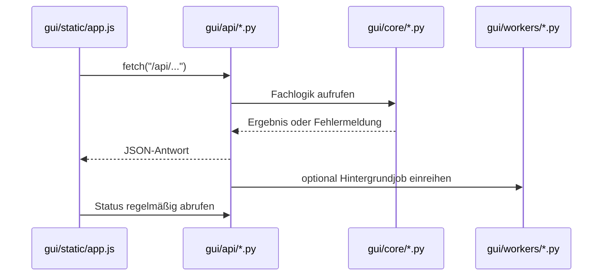

# API und Frontend

Die Oberfläche ist eine Vanilla-JavaScript-Anwendung unter `gui/static/`.
Sie ruft JSON-Endpunkte des Flask-Backends auf und hält UI-Zustand wie aktuell
ausgewählte Projekte, Profile und Verarbeitungsoptionen im Browser.

## Backend-Registrierung

`gui/main.py` registriert alle Blueprints mit dem Präfix `/api`.

| Blueprint | Modul | Zuständigkeit |
|-----------|-------|---------------|
| `system_api` | `gui/api/system_api.py` | Status, Einstellungen, Statistik, Logs und Profile |
| `project_api` | `gui/api/project_api.py` | Inbox-Projekte, Bereinigung und Smart Inbox |
| `nas_api` | `gui/api/nas_api.py` | NAS-Inhalte, Health-Scan und Duplikate |
| `search_api` | `gui/api/search_api.py` | Metadaten, Episoden-Matching und Schätzungen |
| `queue_api` | `gui/api/queue_api.py` | Vorschau, Job-Queue und Wiederholungen |
| `youtube_api` | `gui/api/youtube_api.py` | Downloads, Merge und Abonnements |
| `nas_renamer_api` | `gui/api/nas_renamer_api.py` | Vorschau, Ausführung und Rollback von NAS-Umbenennungen |

Die vollständige Liste der Endpunkte und Payloads steht in
[API.md](../../API.md).

## Frontend

| Datei | Rolle |
|-------|------|
| `gui/static/index.html` | Seitenstruktur, Tabs, Modals und Formulare |
| `gui/static/style.css` | Layout, Themes und responsive Darstellung |
| `gui/static/app.js` | API-Aufrufe, Rendering, Events und Frontend-Zustand |

`app.js` ist bewusst ohne Framework aufgebaut. Das hält den Start einfach,
führt aber dazu, dass viele UI-Bereiche in einer Datei zusammenlaufen. Bei
Änderungen sollte zuerst geprüft werden, welche API-Antwort ein Bereich
erwartet und welche Render-Funktion danach ausgeführt wird.

## Typischer Anfrageweg

## Kompatibilität

Einige ältere Endpunkte existieren parallel zu kanonischen Routen. Vor dem
Entfernen oder Umbenennen einer Route muss geprüft werden, ob `app.js`, Tests
oder bestehende lokale Nutzung noch darauf zugreifen.
