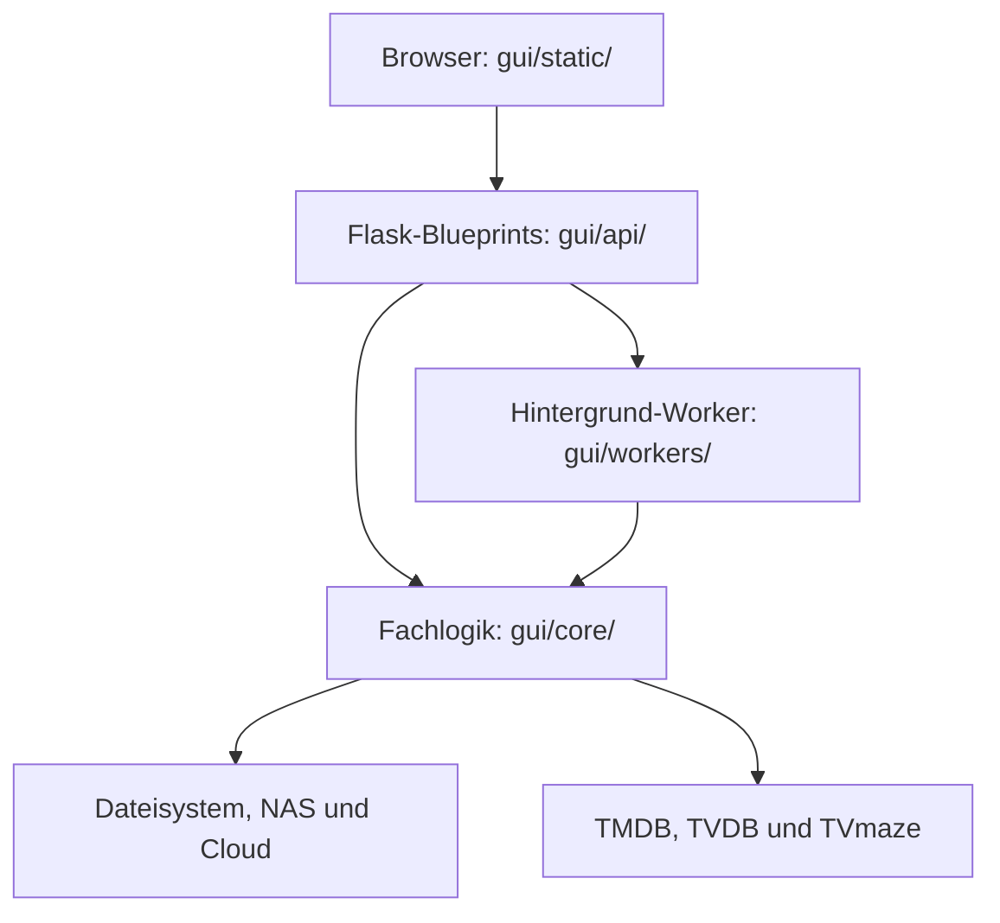

# Architektur

Das Medienwerkzeug ist eine lokal ausgeführte Flask-Anwendung mit einer
Vanilla-JavaScript-Oberfläche. Backend, Worker und Frontend liegen in einem
Repository und kommunizieren über REST-Endpunkte unter `/api`.

## Schichten

## Verzeichnisse

| Pfad | Aufgabe |
|------|---------|
| `gui/main.py` | Erstellt die Flask-App, registriert Blueprints und startet Worker |
| `gui/api/` | Übersetzt HTTP-Anfragen in Aufrufe der Fachlogik |
| `gui/core/` | Enthält Medien-, Transfer-, Health-, Duplikat- und Hilfslogik |
| `gui/workers/` | Führt länger laufende Jobs im Hintergrund aus |
| `gui/static/` | Enthält HTML, CSS und die Frontend-Logik |
| `tests/` | Unit- und Integrationstests |

## Startablauf

`gui/main.py` registriert sieben Blueprints: `system_api`, `youtube_api`,
`nas_api`, `project_api`, `search_api`, `queue_api` und `nas_renamer_api`.
Beim Start werden Inbox und Outbox angelegt, der `job_queue_worker()` gestartet
und ein Thread zur Größenüberwachung der Arbeitsordner eingerichtet.

## Zentrale Abhängigkeiten

`load_settings()` in `gui/core/utils.py` ist die wichtigste gemeinsame
Abhängigkeit. API-Module, Worker und Transferlogik lesen darüber Pfade,
Speicherziele und Kategorien. Änderungen an der Settings-Struktur haben deshalb
eine breite Wirkung und sollten immer mit Migration bestehender Konfigurationen
gedacht werden.

`process_worker()` in `gui/workers/processor.py` ist der zentrale Einstieg für
Verarbeitungsjobs. Die Funktion koordiniert Dateiumbenennung, optionale
Konvertierung, Outbox-Struktur, Speicherziele und Benachrichtigungen. Änderungen
an diesem Modul haben entsprechend einen großen Wirkungsbereich.

## Weitere Dokumentation

- Nutzerfunktionen und Installation: [README](../../README.md)
- REST-Endpunkte und Payloads: [API-Dokumentation](../../API.md)
- Release- und Feature-Planung: [AFTER_RELEASE_ROADMAP](../../AFTER_RELEASE_ROADMAP.md)
- Historischer Release-Plan: [ROAD_TO_GLORY](../archive/ROAD_TO_GLORY.md)
