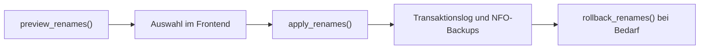

# NAS, Health und Duplikate

Die NAS-Funktionen decken drei unterschiedliche Aufgaben ab: Bibliotheksprüfung,
Duplikat-Erkennung und kontrollierte Umbenennung. Sie greifen auf dieselben
konfigurierten NAS-Pfade zu, haben aber getrennte Verantwortlichkeiten.

## Überblick

| Bereich | API-Modul | Kernmodul | Zweck |
|---------|-----------|-----------|-------|
| Media Health | `gui/api/nas_api.py` | `gui/core/health.py` | Bibliothek auf strukturelle Probleme prüfen |
| Duplikate | `gui/api/nas_api.py` | `gui/core/duplicates.py` | Doppelte Serienepisoden finden und bewerten |
| NAS-Renamer | `gui/api/nas_renamer_api.py` | `gui/core/nas_renamer.py` | Episoden-Namen mit Vorschau und Rollback korrigieren |
| Ignore-Listen | indirekt über NAS-API | `gui/core/ignores.py` | Bewusst ignorierte Findings dauerhaft speichern |

## Media Health

`start_health_scan()` startet einen Hintergrundscan. Der Scan prüft unter
anderem fehlende NFOs oder Artworks, Episodenlücken, leere Ordner, auffällig
kleine Dateien, Namensprobleme sowie fehlende oder ungültige FSK-Altersfreigaben.
Ergebnisse werden gecacht und über `/api/nas/health-status` abgefragt.

Einige Findings können über `/api/nas/health-fix` korrigiert werden (z. B. 
Verschachtelungen auflösen, Umbenennen oder FSK-Werte per XML-Validierung sicher in NFOs eintragen). Diese
Aktionen müssen innerhalb der konfigurierten NAS-Root bleiben und dürfen
bestehende Dateien nicht überschreiben (Ausnahme: FSK-Fix überschreibt das `<mpaa>`-Tag in der NFO).

## Duplikat-Erkennung

`start_duplicate_scan()` sucht serienweit nach mehrfach vorhandenen Episoden.
Die Bewertung bevorzugt HEVC, danach höhere Auflösung und größere Dateien.
Über die API wird eine Empfehlung angezeigt; gelöscht wird erst nach einer
expliziten Auswahl.

Beim Auflösen dürfen ausschließlich Videodateien innerhalb der NAS-Root
entfernt werden. Begleitdateien werden nur nach den Regeln des Kernmoduls
behandelt.

## NAS-Renamer

Der Renamer arbeitet transaktionsorientiert:

`preview_renames()` liest vorhandene NFO-Daten und schlägt Namen vor.
`apply_renames()` wendet nur die ausgewählte Planung an und schreibt ein
Transaktionslog. `rollback_renames()` kann eine Transaktion zurückrollen.

## Sicherheitsregeln

- NAS-Pfade immer gegen die konfigurierte Root prüfen.
- Vor Umbenennungen und Löschungen eine Vorschau anzeigen.
- Nie still überschreiben.
- Fehler sichtbar an API und UI zurückgeben.
- Rückgängig-Funktionen und Backups nicht umgehen.
