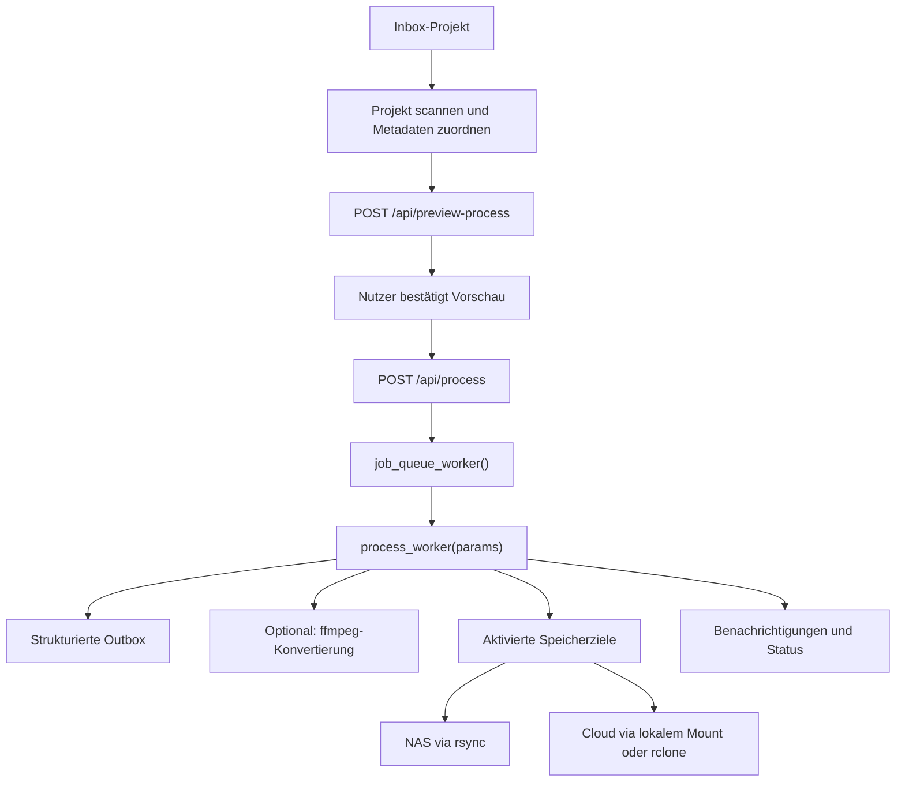

# Verarbeitungsablauf

Die Verarbeitung beginnt nach einer Vorschau und läuft anschließend als
Hintergrundjob. Das Frontend muss daher nicht auf Dateikopien oder Konvertierung
warten.

## Ablauf

## Beteiligte Module

| Modul | Rolle |
|-------|------|
| `gui/api/project_api.py` | Scannt und bereinigt Inbox-Projekte |
| `gui/api/search_api.py` | Sucht Metadaten und ordnet Episoden zu |
| `gui/api/queue_api.py` | Erzeugt Vorschauen und reiht Jobs ein |
| `gui/workers/processor.py` | Führt Jobs aus und aktualisiert den Status |
| `gui/core/transfers.py` | Führt Mount-, Kopier-, Upload- und Konvertierungsbefehle aus |
| `gui/core/notifications.py` | Verschickt Abschlussmeldungen und öffnet Zielordner |

## Queue und Status

`job_queue_worker()` verarbeitet eingereihte Jobs nacheinander und ruft
`process_worker(params)` auf. Der Zustand laufender Jobs liegt in
`active_jobs`; Änderungen werden unter Locks vorgenommen. Für die sichtbare
Fortschrittsanzeige wird eine Pipeline mit Schritten wie Metadaten,
Konvertierung und Speicherzielen aufgebaut.

## Speicherziele

Die Pipeline wird aus `storage_targets` und den Job-Parametern gebildet. Ein Job
kann Ziele einzeln aktivieren. Die Kompatibilitätsfelder `copy_to_nas` und
`copy_to_pcloud` existieren weiterhin, obwohl die neuere Struktur dynamische
Ziele unterstützt.

## Sensible Stellen

- Die Dateistruktur unterscheidet Filme, Serien und YouTube-Inhalte.
- Externe Programme wie `ffmpeg`, `rsync`, `rclone` und `yt-dlp` müssen
  Fehler sichtbar melden.
- Zielpfade stammen aus Einstellungen und Kategorien. Änderungen an IDs oder
  Pfaden wirken direkt auf Kopiervorgänge.
- Bei Löschoptionen muss klar bleiben, ob Originale verschoben, in den
  Papierkorb gelegt oder tatsächlich entfernt werden.
