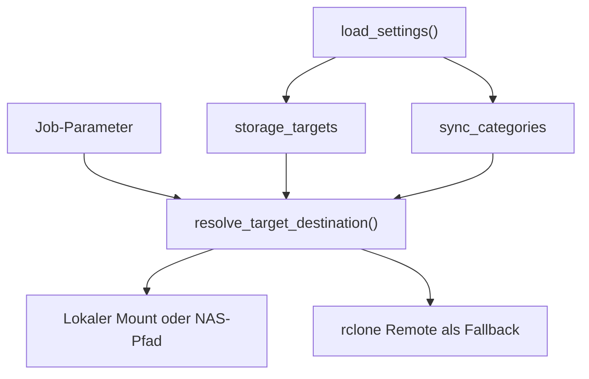

# Einstellungen und Speicherziele

Die Konfiguration ist eine zentrale Abhängigkeit des Projekts. Sie wird lokal in
`gui/settings.json` gespeichert und über `load_settings()` sowie
`save_settings()` in `gui/core/utils.py` gelesen und geschrieben.

`gui/settings.json` ist bewusst nicht versioniert. API-Schlüssel liegen in
`gui/.env`; Platzhalter stehen in `gui/.env.example`.

## Wichtige Bereiche

| Schlüssel | Zweck |
|-----------|-------|
| `inbox_dir` | Eingangsordner für neue Projekte |
| `outbox_dir` | Lokale strukturierte Ausgabe |
| `nas_root` | Legacy-Pfad zur NAS-Root |
| `import_sources` | Quellen für selektiven Import, etwa StreamFab |
| `storage_targets` | Dynamische lokale oder Cloud-Speicherziele |
| `sync_categories` | Kategorien und ihre Ziel-Unterpfade |
| `youtube_subscriptions` | Konfiguration der YouTube-Abo-Überwachung |

## Speicherziel-Auflösung

Speicherziele können einen lokalen Mount-Pfad und optional ein `rclone`-Remote
besitzen. Für Cloud-Ziele wird bevorzugt lokal kopiert. Ist der Mount nicht
verfügbar, kann `rclone` als Fallback dienen.

NAS-Ziele besitzen zusätzlich lokale IP, Backup-/Tailscale-IP,
`nas_hostname` und SMB-Share. Beim Verbinden versucht das Tool zuerst den
direkten SMB-Mount per AppleScript. Falls macOS dabei einen Fehler meldet oder
das Volume nicht zeitnah erscheint, darf nur der manuelle Verbindungsversuch als
Fallback `smb://<nas_hostname>/<nas_share>` im Finder öffnen. Automatische
Verarbeitungsläufe überspringen diesen Finder-Fallback.

`sync_categories` ordnet fachliche Kategorien Unterpfaden zu. Dadurch kann ein
Job etwa eine Serie in einen anderen Zielordner als einen Film schreiben.

## Migration und Kompatibilität

`load_settings()` ergänzt Defaults und migriert ältere Konfigurationen. Einige
Legacy-Felder bleiben synchron zu `storage_targets`, damit vorhandene lokale
Installationen weiter funktionieren.

Bei Änderungen an der Settings-Struktur:

1. Bestehende lokale Dateien migrieren.
2. Defaults für neue Schlüssel definieren.
3. Legacy-Felder nur entfernen, wenn alle Aufrufer angepasst sind.
4. Settings-UI, API-Dokumentation und dieses Wiki gemeinsam aktualisieren.
5. Sicherstellen, dass keine Zugangsdaten in Git landen.
